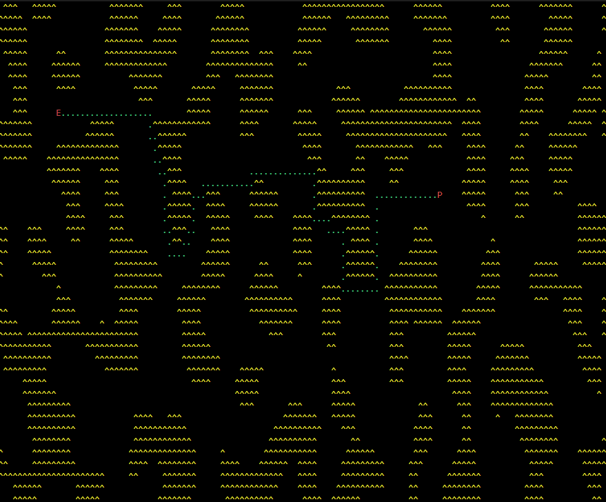

# myCgame
Using C and NCurses to make a game.

## Working
- noise maps working and rendering
- astar pathfinding implemented and working?

## Todo
- limit fps correctly using a deltaTime
- try to fix bug with small viewport, scrambles map

## Notes
- use napms() because its builtinto curses, or just getch, 
- use async (may coroutine) for timed things (E moves once a second, etc.)